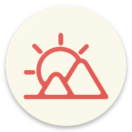
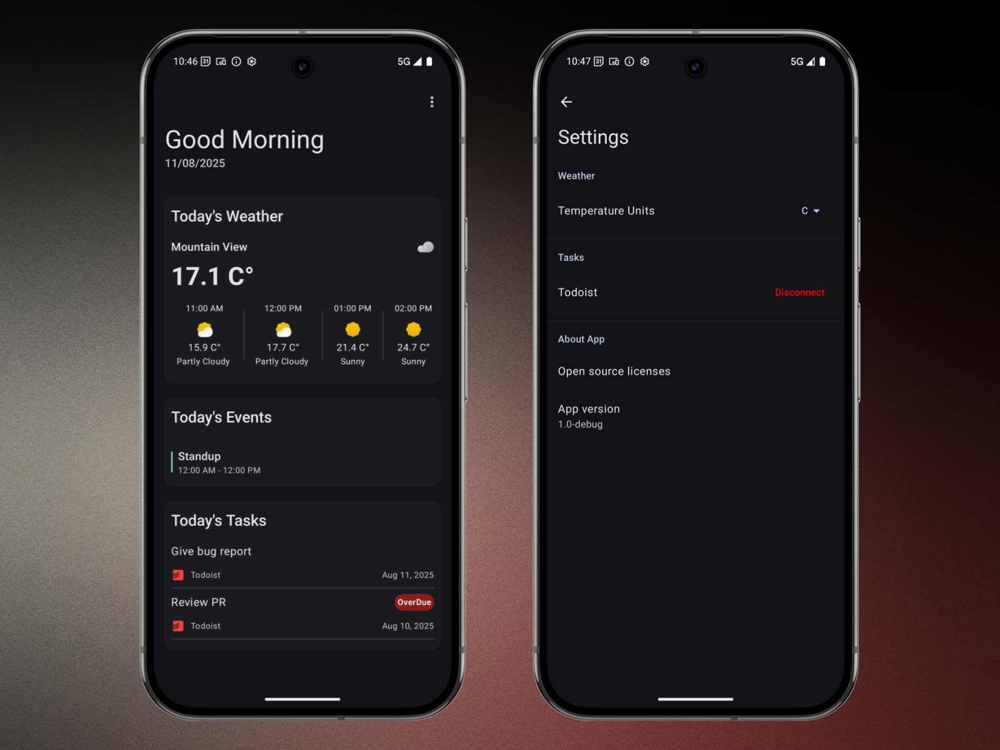
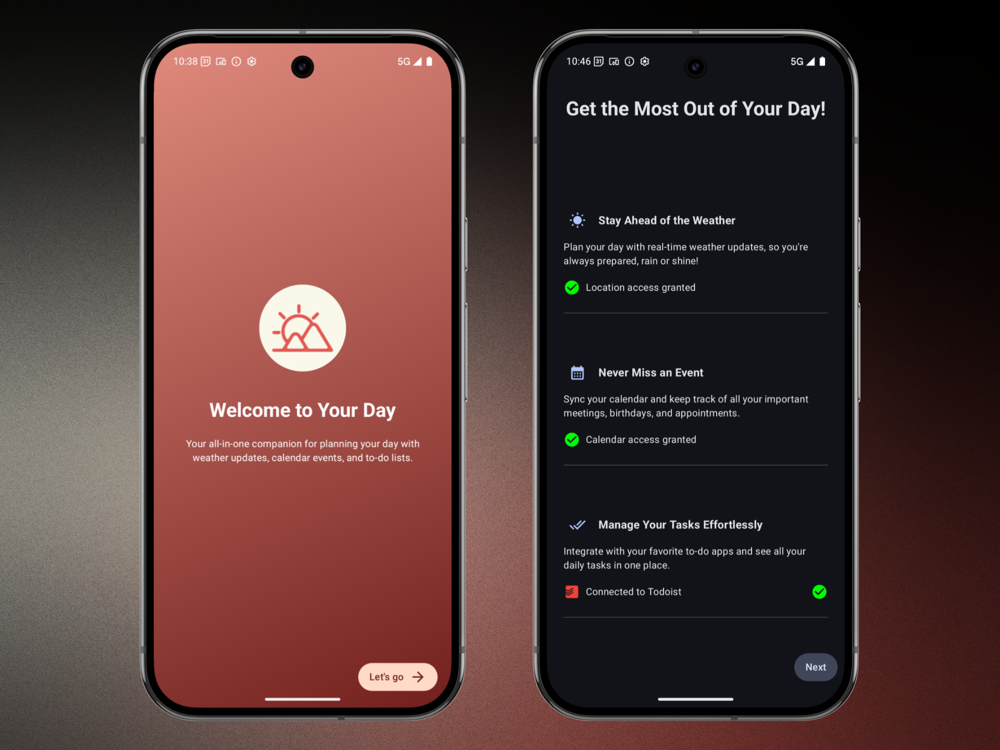
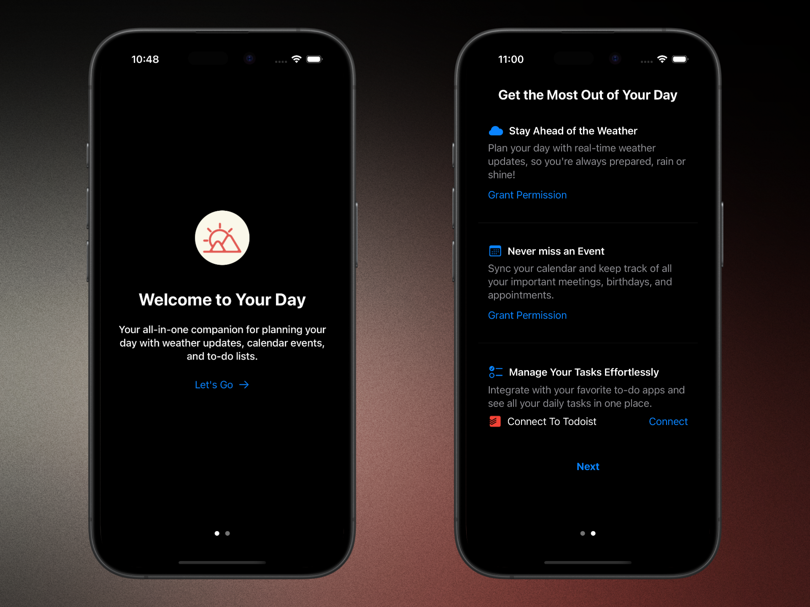
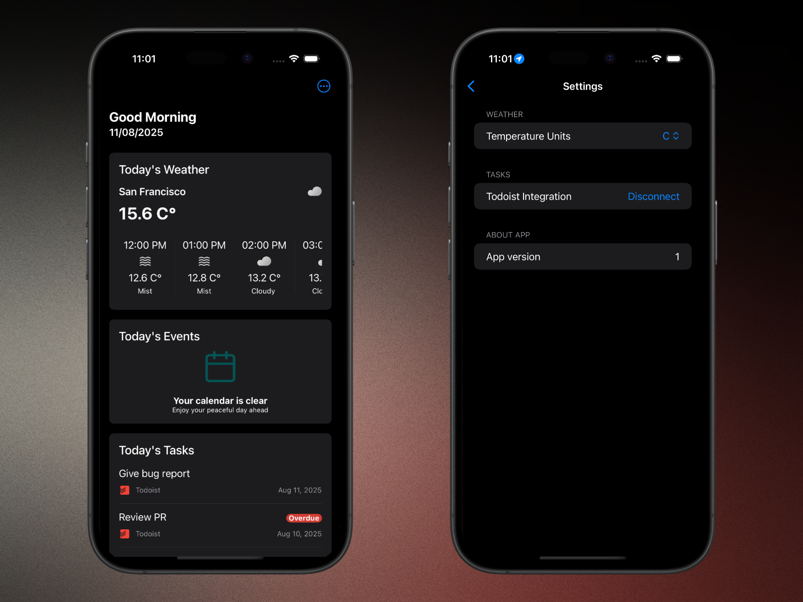

  
  <h1>Your Day</h1>

Your Day provides a quick overview of the current weather, your calendar events for the day, and your Todoist tasks — helping you organize and plan your day efficiently. The app aims to simplify your daily routine by offering timely and relevant information on a single screen with a clean and intuitive interface.

## Tech Stack
- **[Kotlin Multiplatform (KMP)](https://kotlinlang.org/docs/multiplatform.html):** Shared business logic for Android and iOS.
- **[Jetpack Compose](https://developer.android.com/jetpack/compose):** For Android UI.
- **[SwiftUI](https://developer.apple.com/swiftui/):** For iOS UI.
- **[Decompose](https://github.com/arkivanov/Decompose):** Multiplatform lifecycle-aware component library for navigation and business logic.
- **[Todoist API](https://developer.todoist.com/):** API for accessing and managing Todoist tasks.
- **[OpenWeather API](https://www.weatherapi.com/):** Weather data API providing current weather and forecasts.

## Features
- **Current Weather:** Displays temperature, conditions, and forecast for today
- **Calendar Events:** Shows your scheduled events for the current day from local calender
- **Todoist Tasks:** Lists your tasks for the day synced from your Todoist account
- **Settings:** Customize units (Fahrenheit/Celsius), disconnect Todoist account.
- **Cross-Platform:** Works on both Android and iOS with shared business logic

## Screenshots

  

 

  

 

  

 

  

